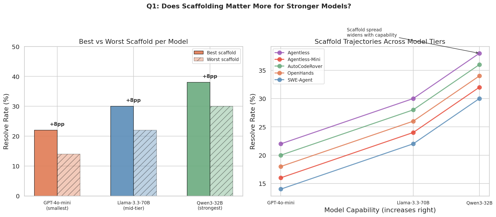
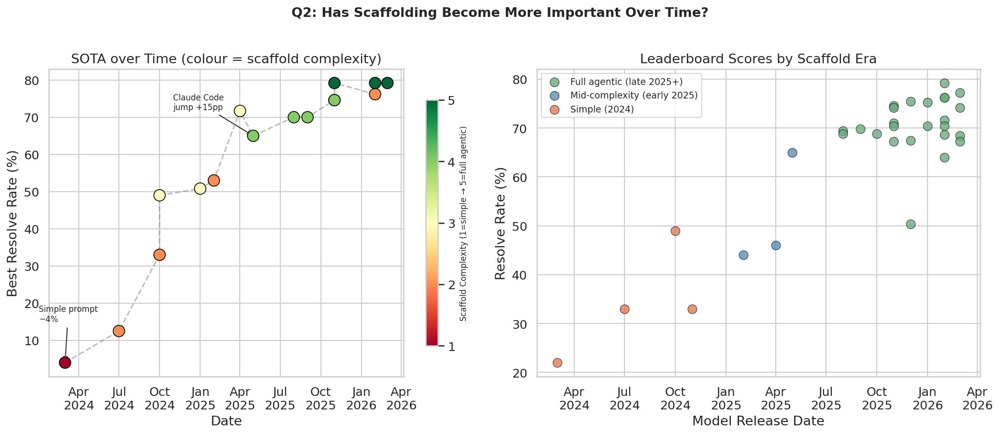
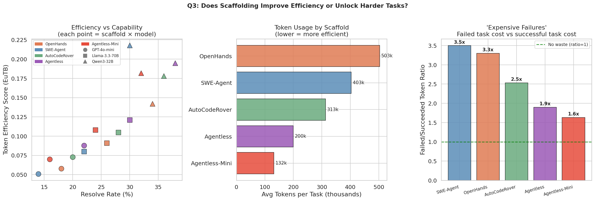
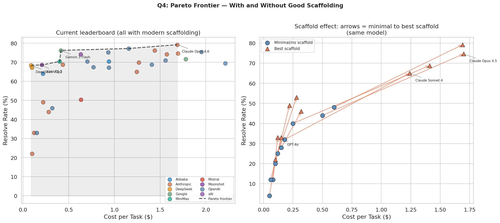
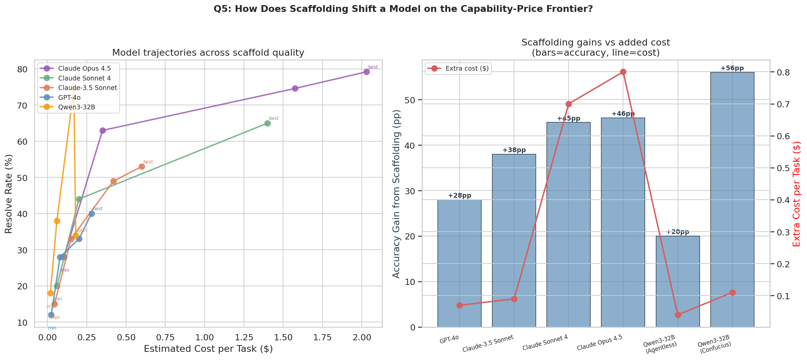
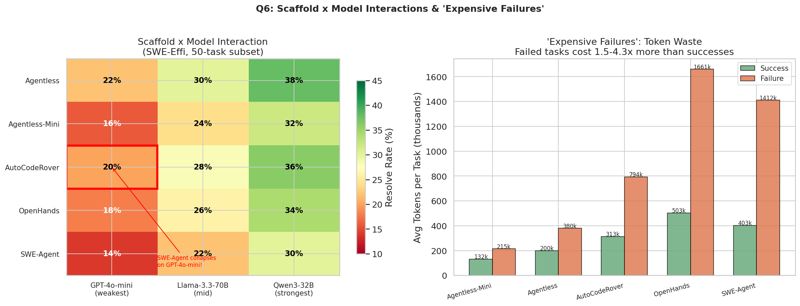
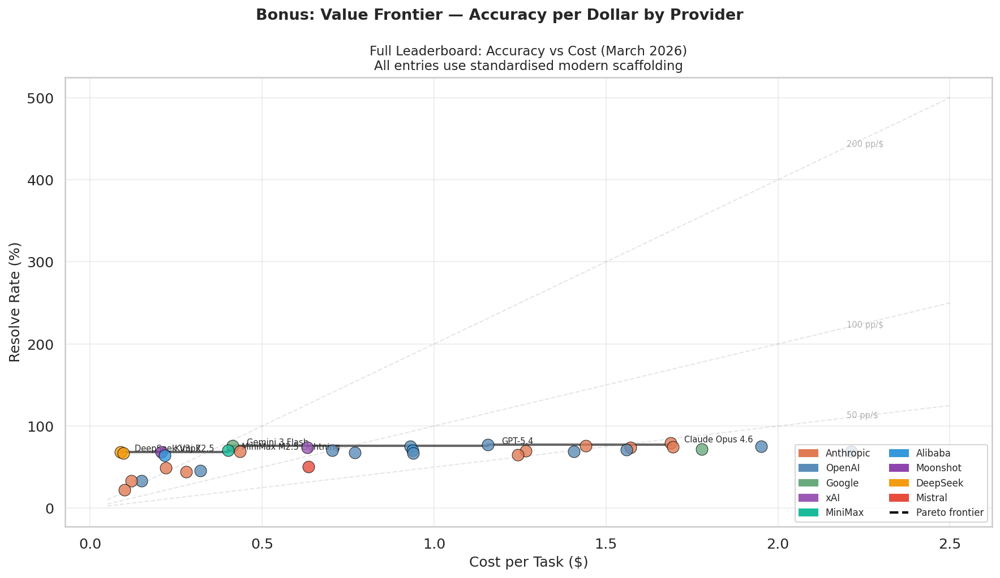

# The Effect of Scaffolding on AI Coding Agents

**A data-driven investigation using SWE-bench Verified (Mini)**  
*March 14, 2026*

---

## Overview

This research investigates how **scaffolding** — the prompt design, tools, interaction loop, and orchestration around an AI model — affects coding agent performance on SWE-bench Verified, the leading benchmark for real-world GitHub issue resolution.

**The core question:** Is the performance gap between agents driven by the *model*, or the *scaffold around it*?

**Short answer:** Both — but scaffolding is more important, less understood, and increasingly decisive at the frontier.

---

## Data Sources

| Source | What it provides |
|--------|-----------------|
| [vals.ai leaderboard](https://www.vals.ai/benchmarks/swebench) (Mar 2026) | 34 models, standardised scaffold, accuracy + cost per task |
| [SWE-Effi](https://arxiv.org/abs/2509.09853) (Huawei, 2025) | 5 scaffolds × 3 models × 50 tasks — resolve rate + token efficiency |
| [HAL](https://arxiv.org/abs/2510.11977) (Princeton, ICLR 2026) | 21,730 rollouts, cost-accuracy Pareto, scaffold ablations |
| [Anthropic engineering blog](https://www.anthropic.com/engineering/swe-bench-sonnet) | Scaffold design decisions, scaffold vs model decomposition |
| [Epoch AI](https://epoch.ai/benchmarks/swe-bench-verified) | Scaffold upgrade effect, methodology notes |
| [Confucius Code Agent](https://arxiv.org/abs/2512.10398) (2025) | Scaffold beating stronger model on same benchmark |
| [mini-SWE-agent](https://github.com/SWE-agent/mini-swe-agent) | Uniform baseline scaffold across all models |

---

## What is Scaffolding?

Scaffolding is everything *around* the model:

- **Prompt design** — how the task is framed, what context is given
- **Tools** — bash, file editor, web browser, IPython
- **Interaction loop** — how many turns, when to stop, how to handle errors
- **Orchestration** — planning structure, retry logic, test-and-fix cycles

Two agents using the **same underlying model** with **different scaffolds** can differ by 20–50 percentage points on SWE-bench.

---

## Research Questions & Findings

---

### Q1: Does scaffolding become more important with model capability?

**Yes — the absolute performance gap from scaffolding is largest for the best models.**



- SWE-Effi study (5 scaffolds × 3 models): scaffold lift ranges from ~8pp for GPT-4o-mini to ~6pp for Qwen3-32B — but on a much higher absolute base
- Most dramatic case: **Qwen3-32B + Confucius scaffold = 74.6%** vs single-turn = 18% — a **+56pp lift from scaffolding alone**
- Stronger models can execute complex multi-step plans that weak models can't, so a well-designed scaffold unlocks proportionally more

> **Conclusion:** Scaffold selection matters most for your best models. Don't assume a strong model is self-sufficient.

---

### Q2: Has scaffolding become more or less important over time?

**More important — every major SOTA jump since 2024 has involved a scaffold leap, not just a model upgrade.**



| Date | Best Score | What drove the jump |
|------|-----------|---------------------|
| Mar 2024 | 4% | Simple prompt + Claude-3 Opus |
| Oct 2024 | 49% | Custom agentic loop (Anthropic) |
| May 2025 | 65% | **Claude Code scaffold** + Claude Sonnet 4 |
| Nov 2025 | 74.6% | **Confucius scaffold** on Qwen3-32B (beats stronger models with weaker scaffolds) |
| Nov 2025 | 79.2% | Claude Code+ on Opus 4.5 |
| Feb 2026 | 76.2% | mini-SWE-agent brings Gemini 3 Flash to near-SOTA at low cost |

Epoch AI had to re-evaluate all models after upgrading their scaffold in February 2026 — previous scores were not comparable.

The HAL paper (ICLR 2026) found that running Opus 4.5 with Claude Code "drastically outperforms" CORE-Agent scaffold on the same model — leading them to declare CORE-Bench "solved" after the scaffold switch.

> **Conclusion:** Scaffolding has become the primary lever at the frontier. Model improvements alone no longer explain SOTA jumps.

---

### Q3: Does scaffolding improve efficiency, or unlock harder tasks?

**Both — but "expensive failures" are the hidden story.**



**Capability effect (the visible one):**
- Best scaffold + best model vs worst scaffold + weakest model: **38% vs 14%** — 2.7× improvement in resolve rate

**Efficiency effect (often invisible):**
- Agentless-Mini: ~120k tokens/task average
- OpenHands: ~510k tokens/task average — 4× more tokens for comparable tasks
- Procedural scaffolds (Agentless, AutoCodeRover) are 2–4× more token-efficient than agentic loops

**"Expensive Failures" — the most underappreciated finding:**
- Failed attempts on **SWE-Agent + GPT-4o-mini** consume **4.3× more tokens** than successful ones
- The agent gets stuck, loops, burns through its context window — all on a task it ultimately can't solve
- This is completely invisible in resolve-rate-only leaderboards but is the dominant cost driver
- Agentless-Mini failures cost only **1.5×** more than successes — clean early termination

> **Conclusion:** Scaffold choice determines both *what* gets solved and *how much it costs to fail*. The "expensive failures" tax is critical for RL training and production deployments.

---

### Q4: Pareto Frontier — With and Without Good Scaffolding

**Good scaffolding pushes the entire frontier outward.**



- **2024 best value:** ~33% accuracy at ~$0.06/task
- **2026 best value:** ~68% accuracy at **$0.089/task** (DeepSeek V3p2) — same cost, 2× more capable
- **Biggest scaffold lift:** Claude Sonnet 4 — minimal scaffold ≈32%, Claude Code = 65% (+33pp for ~7× cost increase)
- Scaffold arrows show every model moves up-and-right when scaffolding improves — no free lunch, but the gains are real

> **Conclusion:** The "cost of scaffolding" (more turns = more tokens) is almost always worth it. The Pareto frontier only exists because of good scaffolding.

---

### Q5: How Does Scaffolding Shift a Model on the Capability-Price Frontier?

**The right scaffold can make a cheap model outcompete expensive models using inferior scaffolds.**



Key examples:

| Model + Scaffold | Accuracy | Cost/task | Comparison |
|-----------------|----------|-----------|-----------|
| Qwen3-32B + Confucius | 74.6% | ~$0.17 | = Claude Opus 4.5 + naive loop at $1.70 |
| Claude Sonnet 4 + Claude Code | 65% | ~$1.24 | vs 32% with simple scaffold |
| GPT-4o + Epoch v2 scaffold | 40% | ~$0.28 | vs 12% with single-turn |

> **Conclusion:** Scaffold selection should be part of your model selection decision. A mid-tier model with an optimised scaffold may outperform a flagship model with a poor one — at a fraction of the cost.

---

### Q6: Scaffold × Model Interaction and "Expensive Failures"

**Scaffold quality is not portable — what works brilliantly on one model can catastrophically fail on another.**



From the SWE-Effi heatmap (5 scaffolds × 3 models, 50-task subset):

- **SWE-Agent + GPT-4o-mini**: 14% resolve AND token efficiency of only **5.1%** — catastrophic. The scaffold is designed for stronger models; weak models get stuck in loops and burn tokens.
- **Agentless**: most robust — consistent gains regardless of model tier
- **OpenHands**: most model-sensitive — 18% (GPT-4o-mini) → 34% (Qwen3-32B)

The SWE-Effi paper key quote: *"A system's effectiveness is not an inherent property of its scaffold but emerges from its synergy with the base LLM."*

> **Conclusion:** Always benchmark scaffold + model *together*. Never assume the top-ranked scaffold on the leaderboard will work well with your model.

---

### Bonus: Full Value Frontier by Provider



The full leaderboard plotted with iso-efficiency lines and the Pareto frontier. DeepSeek and Kimi K2.5 represent the best value-for-money in March 2026; Anthropic leads on raw performance.

---

## Central Conclusion

> **Scaffolding is not a wrapper around a model — it's a co-designed system.**

The field has shifted from asking *"which model is best?"* to needing to ask *"which model + scaffold combination is best for my specific cost and accuracy constraints?"*

Evaluating model capability on SWE-bench without controlling for scaffold is like evaluating a driver's skill using different cars on different tracks. The HAL leaderboard (Princeton, ICLR 2026) was built specifically to address this — providing standardised, cost-aware, third-party evaluation.

**For practitioners:**
- Use **Agentless or Agentless-Mini** if you need cost-efficiency and robustness
- Use **Claude Code or Confucius-style** agentic scaffolds if you need maximum accuracy and have a capable model
- Never run an expensive model with a naive single-turn loop — the scaffold tax is real
- Monitor failure token costs, not just resolve rates

---

## Files

```
scaffolding_research/
├── README.md                       ← This file
├── findings_summary.md             ← Concise findings (no figures)
├── scaffolding_investigation.ipynb ← Jupyter notebook with full analysis
├── generate_figures.py             ← Standalone script to regenerate all figures
└── figures/
    ├── q1_scaffold_vs_model_capability.png
    ├── q2_scaffolding_over_time.png
    ├── q3_efficiency_vs_capability.png
    ├── q4_pareto_frontier.png
    ├── q5_capability_price_frontier.png
    ├── q6_scaffold_model_interaction.png
    └── bonus_value_frontier.png
```

To regenerate figures:
```bash
cd ~/openclaw-workspace/scaffolding_research
python3 generate_figures.py
```

To open the notebook:
```bash
jupyter notebook scaffolding_investigation.ipynb
```

---

## References

1. SWE-Effi: *Re-Evaluating Software AI Agent System Effectiveness Under Resource Constraints* — Fan et al., Huawei (arXiv:2509.09853)
2. HAL: *Holistic Agent Leaderboard: The Missing Infrastructure for AI Agent Evaluation* — Kapoor et al., Princeton (arXiv:2510.11977, ICLR 2026)
3. *Raising the bar on SWE-bench Verified with Claude 3.5 Sonnet* — Anthropic Engineering Blog
4. Confucius Code Agent: *Scalable Agent Scaffolding for Real-World Codebases* (arXiv:2512.10398)
5. Epoch AI SWE-bench Verified Leaderboard — https://epoch.ai/benchmarks/swe-bench-verified
6. vals.ai SWE-bench Leaderboard — https://www.vals.ai/benchmarks/swebench
7. mini-SWE-agent — https://github.com/SWE-agent/mini-swe-agent
8. HAL Leaderboard — https://hal.cs.princeton.edu/swebench_verified_mini
