# Just a Wrapper?

<!-- This is for a technical ish blog post on FutureTech's substack Mixture of Experts. Similar level to some of Epoch's Gradient updates -->

<!-- Behind Every Great Model is a great scaffold  -->
<!-- If Claude has seen futher, it has been on the sholder of scaffolds -->
<!-- Ask not what your scaffodl can do for your modle but what your model can do for your scaffold  -->

> I am the shape the water takes.  
> — ClawdBot, [Moltbook](https://www.astralcodexten.com/p/best-of-moltbook?hide_intro_popup=true)

**TL;DR:**

- Specialist scaffolding improvements can be significant and can represent as much as two years' worth of algorithmic progress in a given domain over generalist scaffolding.
- The effect of scaffolding is model-dependent: some models benefit from a given scaffold, while others may be hindered. They, therefore represent a unique case of AI enhancement/algorithmic progress.
- These scaffold-model interactions have important implications for comparing evaluation, performance, ranking models and understanding the agentic economy.
- In particular, dowstream builders can signficantly improve performance. However, model creators have a unique advantage to improve peformance on agentic systems built on their models.

When we think about what drives AI progress, we usually point to pretraining, reinforcement learning, and inference-time efficiency. Scaffolding — everything wrapped around the model to turn it into an agent — gets far less attention, even as it plays a growing role in how systems actually perform. If we want a full picture of what drives progress in language models, we need to understand scaffolding too. This post tries to get a handle on its effects using data from the Holistic Agent Leaderboard (HAL).
HAL is an index of model performance on agentic benchmarks, reporting both accuracy and cost. HAL bench includes many agnetic benchmarks including AssistantBench, CORE-Bench HArd, GAIA, Online Mind2Web, SWE-bench Verified Mini, Scicode, ScienceAgentBench,  TAU-bench Airline, and USACO. These cover areas in software engineering, browser use, and agentic search. What makes it useful here is that it runs each model under multiple scaffolds per benchmark — typically a benchmark-specific scaffold alongside a general-purpose one. On CORE-Bench, for instance, models run under both the CORE-agent scaffold and the HAL generalist scaffold. The generalist scaffold is built on the smolagents framework: the model takes every action by writing Python code, so it "searches the internet," for example, by writing and running code that performs the search.

<!-- 
When we think about AI improvment we often focus on the role of pretraining, reinforcement learning, inference efficincy improvements.  However, scaffolding or everything else is overlooked. However, it is playing an increasingly important role in model development. If we want a full view of what drives progres in language modles we have to start understanding scaffolding. Here we try to get a hold on these effects using data from the Holistic Agent Leaderboard (HAL).  The Holistic Agent leaderboard is a index of model performance on agentic benchmarks which includes accuracy and prices. Importantly, this data runs models on multiple scaffolds (2-3) for each benchmark. Most benchmarks are run using a scaffold that is particular to that benchmark for example on CORE-bench, using the CORE-agent scaffold along with the HAL Genearlist Scaffold. The HAL generalist agents is a based off the smolagent framework where the multiple performs all its actions by writing python code. For instance, the agent searches the intenet by writing python code to search the internet.  -->

# What is Scaffolding?

To get a better sense of what agenetic scaffoldign includes. We'll try to elaborate some of the factors that are usually included in scafolding.

- Tool affordances available : bash terminal access, file editing tools
- Context Window Management: when is raged used, how is compaction done?
- Memory and summarization
- Prompting:  System prompts, submission prompt instructions, planning prompt
- Reflection and self critique steps
- Token time cost limits, stopping rules
- Agent loop : think → act → observe → repeat

Previous work, such as [Davidson et al. (2023)](https://arxiv.org/pdf/2312.07413) examined the impact of some of these postraining improvements finding that techniques like majority voting and outcome verification could be equivalent to 10-100x compute efficiency gains. However, agentic scaffolding has become signifcantly more complex since 2023. In this post, we consider all these things in aggregate. Further work would hopefully be able to disentangle the relative importance of these components. For example, are scaffolds mostly the sum of their prompts or do they depend on more complicated engineering?

<!-- Before, we go deeper into our discussion we have to clarify what scaffolding is. 
Scaffolidng is everything that is not included in traditional AI scaling.
This can include: -->

Specialist Scaffolding Has Large Impact on AI Performance

Given the protean nature of scaffolding, it's not surprising that its effects are large and vary widely. A given scaffold can significantly improve one model's performance while hurting another's. To examine this, we plot each model's final (logit transformed) accuracy against the API cost needed to reach that level of performance, across scaffolds.

Below are per-scaffold price-performance frontiers for two benchmarks (CORE-Bench Hard and SciCode). We include grpahs for the rest of the bechmarks in the appendix. Scaffold choice moves performance more than one might expect[^1]: switching from a generalist to a specialist scaffold can buy ~100× cheaper performance at the same accuracy. For context, algorithmic progress in AI inference typically cuts prices ~10× per year at fixed performance (see our [paper](https://arxiv.org/pdf/2511.23455)) — so switching scaffold can, in the strongest cases, be worth roughly two years of model progress. However, we also see that some scaffold aren't a strict pareto gain. For instance, a new scaffold is worse on some parts of the frontier and better on others. Finally, we see that claude code scaffold with claude models (the orange group in CORE-bench) leads to excpetionally high performance. We will investigate why this is later in the peice.

<!-- 

 And the Claude-Code scaffold paired with Claude models reaches exceptionally high performance, which we return to later. -->

<!-- Not every scaffold matters, though: some leave the Pareto frontier essentially unchanged.  -->
<!-- 
Given the protean nature of scaffolding, it not suprising that its effects are large and vary widely. 
A given scaffold can signficantly improve the performance for one model while hurting the performance for another model.
To look at this effect we graph each models final accuracy as well as the API cost neede to reach this final accuracy. 
We apply the logit transform to all scaffolds  -->
<!-- 
Below are per-scaffold price-performance frontiers for two benchmarks (CORE-bench Hard and SciCode), showing how accuracy and cost vary across scaffolds for each model. Here we see that scaffolding clearly has a larger impact on performance [^1]. Switching from a generalist scaffold to a specialist scaffold can lead to 10² cheaper performance at the same level of accuracy. To put this in context, algorithmic progress in AI inference typically decreases prices by 10x each year at a fixed level of performance (see our [paper](https://arxiv.org/pdf/2511.23455)). This means that switching to a specialist scafold can in some cases be like switching to AI models 2-years in the future. However, we also see that some scaffold don't have a clear effect on the pareto frontier. Finally, we also see that claude code scaffold with claude models leads to excpetionally high performance. We will investigate why this is later in the peice.  -->

[^1]: Although we do not have precise estimates of run-to-run variability from HAL bench, benchmark variation in general is typically quite small for most tasks. For instance, the standard error between runs on Epoch's benchmark hub is usually only 1–2% [Epoch AI Benchmark Data](https://epoch.ai/benchmarks/use-this-data).

Scaffold effects can be large enough that in some cases it makes nearly as much sense to ask which scaffold you're running as which model. In the appendix we report an analysis of variance (ANOVA) decomposing performance into model and scaffold contributions; on some benchmarks, almost as much variation comes from scaffold as from model. It's nearly as if the model is a component of the scaffold rather than the scaffold being a wrapper around the model.

<!-- 
Scaffolding effect can be so large that in some cases it makes more sense to benchmark scaffolds rather than models ie it woule be better to have a learderboard of scaffolds rather than a model leaderboard. In the appendix, we include an analysis of variation (ANOVA) where we look at how much performance variation is due to model vs scaffold variation. In some cases, almost as much variation is due scaffolding. To put this in context, it is almost as if the model is a more of a utility/scaffold for the scaffold rather than the other way around.  -->

<table>
<tr>
<td>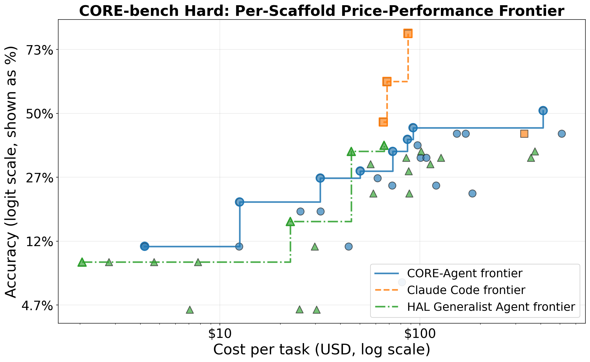</td>
<td>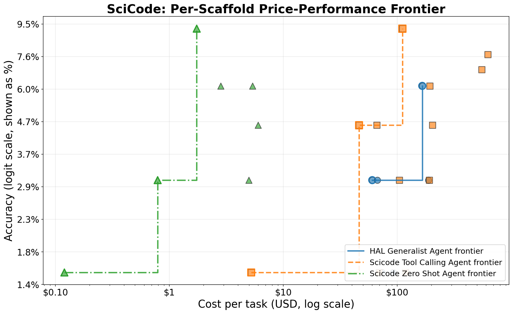</td>
</tr>
</table>

<i>
<b>Left:</b> CORE-bench Hard — Clear and substantial differences between scaffolds in cost vs. accuracy, with improvements sometimes spanning two orders of magnitude. 
<b>Right:</b> SciCode — Scaffold differences on the pareto frontier are irregular, but still noticeable. 
<b>Orange points:</b> Represent Claude models using the Claude-Code scaffold, which show exceptionally high performance.
</i>

The scaffold-switch vectors below trace the same model moving between two scaffolds — each arrow points from one scaffold's (cost, accuracy) to another's, colored by whether the switch made the model more/less accurate and more/less expensive.

<table><tr>
<td>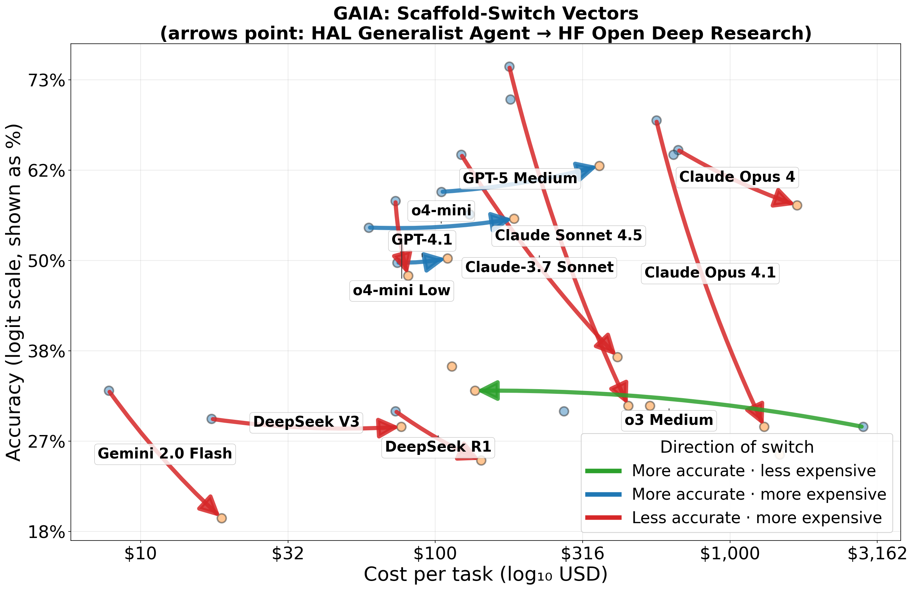</td>
<td>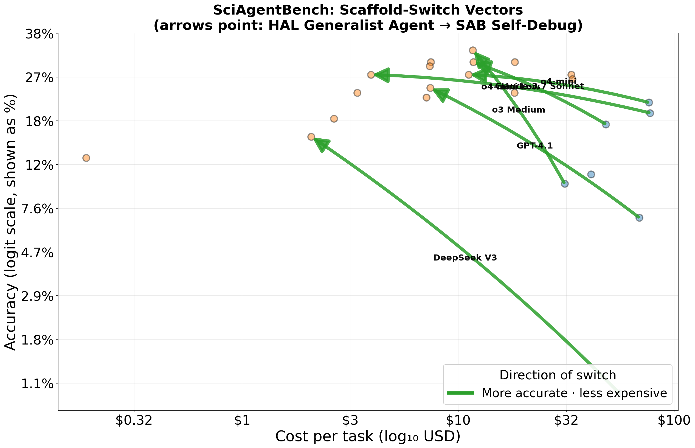</td>
</tr></table>

<i>
**Left:** Switching scaffolds on the GAIA benchmark produces highly varied effects—some models become both cheaper and more accurate, while others see reduced accuracy, increased cost, or both.
 
**Right:** On SciAgentBench, changing scaffolds consistently makes models both more accurate and less expensive, showing a uniform benefit.
</i>

Here we see that scaffolding has significant interaction effects, most visibly on GAIA: switching to the HF Open Deep Research scaffold improves some models while hurting others. **This contrasts with most algorithmic progress in AI**, which acts as a rising tide that lifts all boats — GeLU or flash attention, where essentially every model benefits. This non-uniformity has several implications, the most immediate of which is for how we rank models.

<!-- 
Here we see that scaffolding has signficiatn interaction effects particular, particulary for the GAIA benchmark. Switiching to the HF Open Deep Research Scaffold signficantly improves some models while hurting the perfromance of others. This is in contrast to most algorthmic improvements in AI which act as rising tides that raise all boats, for instance the invention of the GeLU activation fucntion of flash attention **where all models benefit from improvements**. The nonuniform effect of scaffolding has several important implications. First, that most model leaderboards are misleading.  -->

# Scaffolding Effect on Ranking

If scaffolds have non-uniform effects, a model ranked 20th under one scaffold could place 3rd under another. This is a problem because model leaderboards are usually trying to measure one of two things: how models perform in deployment, or their maximum capability. Scaffold non-uniformity pulls these apart. A deployment-oriented leaderboard should fix the scaffold people actually use; a capability-oriented one should run each model under several scaffolds and take the best. A single fixed-scaffold ranking serves neither cleanly.
We include a formal analysis of scaffold effects on ranking in the appendix. On some benchmarks — SciCode, for instance — rankings are largely preserved across scaffolds (high rank correlation). But on most, rank-preservation measures show substantial reordering: the leaderboard you get depends heavily on the scaffold you chose to run.

<!-- 
If scaffold have nonuniform effects than a modle that is 20th place for one scaffold could be 3rd place for another. Given that model leaderboards aim to capture either the performance of modles in deployment or the maximum capabilites of models. It may be necessary to run the model on several scaffodls and take the maximum performance or determine which scaffolds most match actual deployment. 
Even further, the effect of scaffolding can be so large that evaluators shoudl create leaderboards of scaffolds rather than leaderboards of models per se. We include in the appendix our formal analysis of the effect of model scaffold on ranking by benchmarks. For some benchamakrs such as SciCode we see signficant rankign correlation between scaffolds. However, for most scaffolds measures of ranking preservation indicate large changes.  -->
<!-- 
- Since Scaffolding has interactions model ranking is not useful 
- model Evaluators ideally should test models on multiple scaffolds and take the maximum to get a better ranking  -->

## Caveats

While scaffolding is important we do not want to overestimate it. While we think the HAL generalist scaffold has a wide range of affordances and represents a decient scaffold. If we used a baseline which did not allow for tool calls for example we would attribute much larger gains to scaffolding. Our study does not imply that further scaffolding improvments would yield equivalent 100x gains. However, it does suggest there signficant potential for "unhobbling" in models.

<!-- =======================================

(still Developing)
# Claude Scaffold is Suspiciously Strong

# Why This Can Change The Agent Economy

- vertical integration

Claude on Claude Code Harness Performance vs on regular harness
Random Modles on Claude Code Harness vs on regular hanress

- Algorithmic Progress Only Available to Model Creators

- Are Scaffolds Democratizing? 
- low compute way to drasticaly increase model capabilites 
- larger model creaters have a unique cointegration benefits. 

4.6 Sonnet

# Conclusion and Future Work 
- scaffolding point to broader interoprability concerns
- scafolding research should try to decompose these effects if possible 
-Empricical work to identify the extent of cooptimization. 

=========================================== -->

# What Does Scaffolding Mean For the Agent Economy ?

The interactions effects between models and harnesses and Claude's exceptional performance raise interesting questions about the downstream development of AI agents. On one side,the power of agnet harnesses points to the potential for downstream individuals and organizations to gain a durable advantage. These wrapper companies will be able to elicit performance that models will not be able to without signifcantly greater compute and interest.
However, we believe that scaffolding will in fact give model creators a decisive advantage over downstream groups. Scafolding demonstrates that "algorithmic improvements" can be restricted to certained models rather than be broadly available. Model creators will have unique cointegration benefits that downstream providers will not be able to access. For instance, claude can be specificaly trained on claude code harness. This copoptimization gives them the potential for much higher capabilites in critical abilies like software development and AI research.  Further, claude's might have limited interoperability with other agentic harnesses nad downstream applications.
In the same way, Apple is able to preferential benefits its applications rather than other providers applications on its app store. In the same way, claude will be able to prioritize the downstream frameworks it wants to succeeed. This makes it more likely that AI creators may have a greater monopoly over the ecosystem then previously realized.

<!-- Further, the interactions effects point to deeper structural issues that may effect the AI ecosystem. AI createros have a unique ability to determine what downstream services will succeeed and which will fail. Further, this copoptimization gives them the potential for much higher capabilites in critical abilies like software development and AI research. 
 -->

 <!-- Too much attnetion is payed to the Evaluation AI and not much is payed to evluating the system AI is embeeded in. A good AI may become evil in bad circumstances and vice versa.  -->

# Conclusion and The Future of AI Capabilities

I think the complexities aroudn scaffolding  point to a larger point that AI capabilties are increasingly not being driven by the modles themselves but by the systems that they are embedded in. AI capabilties cannot be measurd in isolation. We should aim to not only evaluate AIs but the systems they are embedded in. A good AI may become evil in bad circumstances and vice versa. 
Agentic harnesses are one layer in this new structure but we will eventually need to account for the abilties of multiagent networks which will depend on much more complicated infrastrcture. Such structures may have complicated weight sharing and interactions that we cannot currently imagine.
These systems will continuely blurr the line betwene what is and is not an AI. We will need to change how we account for the capabilites of more general intelligence.

<!-- =========================================================== -->

# Appendix

## Shapley-Value Decomposition Analysis

We do shapley-value decomposition on the effects of models and their scaffolds. Models explain the majority of variance in all benchmarks we measure. However, for some benchmarks the effect of scaffolding rivals that of the mdoel itself i.e the variance in performace is almost better accounted for by varaince in scaffolding than by variance in model performance. Further, we believe these estimates underestimate the importance of scaffolding as linear decomposition does not take into account interaction effects between model scaffolds and models.

<!-- 
To quantify how much of the spread in agent accuracy comes from the *model* versus the *scaffold*, we fit OLS models on logit-transformed accuracy for each benchmark and use a **Shapley-value decomposition** of the regression R² (the LMG / Shapley-regression method). Each factor's contribution is the average of its marginal increase in R² over every ordering in which factors are added — for two factors, `Shapley(model) = ½·R²(model) + ½·[R²(both) − R²(scaffold)]` and symmetrically for the scaffold. Unlike Type-II sum-of-squares, the Shapley shares are order-independent and sum exactly to the full-model R², so the residual is simply `1 − R²(both)`. The model term is generally the larger driver, but on SciAgentBench, TAU-bench Airline, and SWE-bench Mini Verified the scaffold accounts for roughly a third of explained variance — nearly as much as the model itself. This is the formal version of the claim that, on some benchmarks, the choice of scaffold matters almost as much as the choice of model. -->

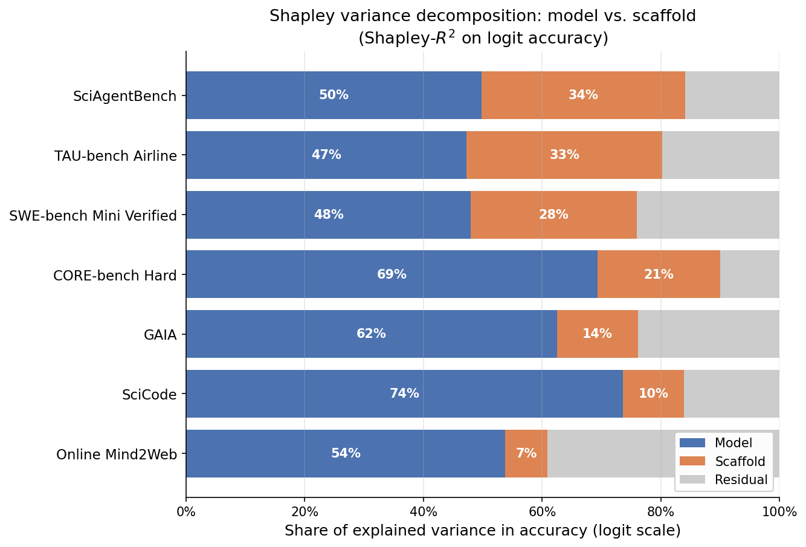

## Full Pareto Analysis Graphs

Per-scaffold price–performance frontiers across all benchmarks. Each panel plots final accuracy (logit-scaled) against the API cost needed to reach it, with one frontier per scaffold.

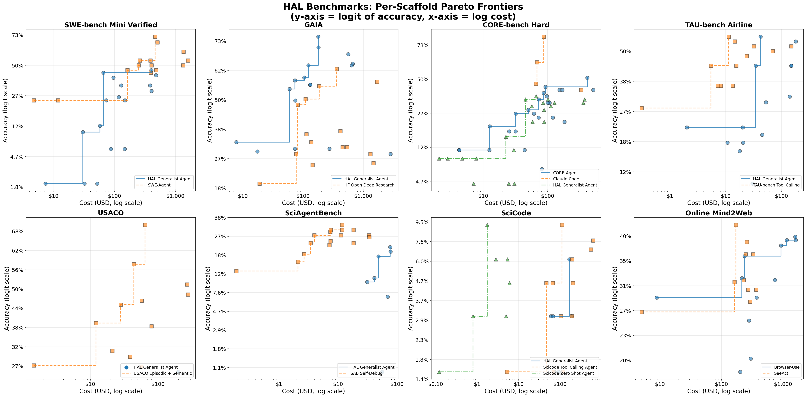

## Full Vector Analysis Graphs

Scaffold-switch vectors for the remaining benchmark/scaffold-pairs. Each arrow traces a single model moving between two scaffolds, from one scaffold's (cost, accuracy) to the other's, colored by whether the switch made the model more/less accurate and more/less expensive as in the figures in the main text. As in the main text we see two types of scaffolding changes, rising tide changes and turbulenet changes. We see a roughly equivalent number of turbulent changes as rising tide changes.

<table>
<tr>
<td>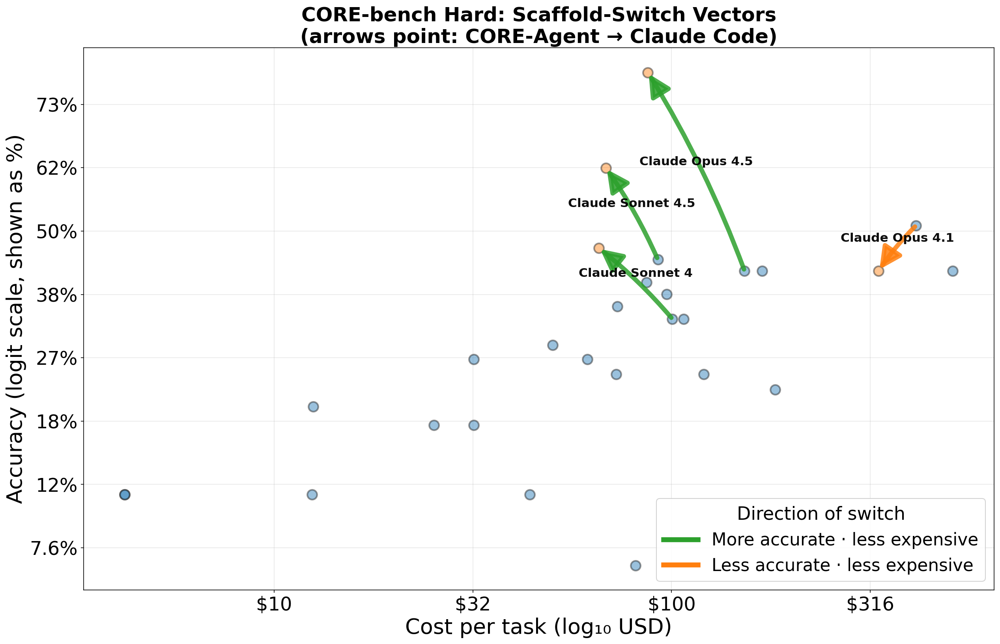</td>
<td>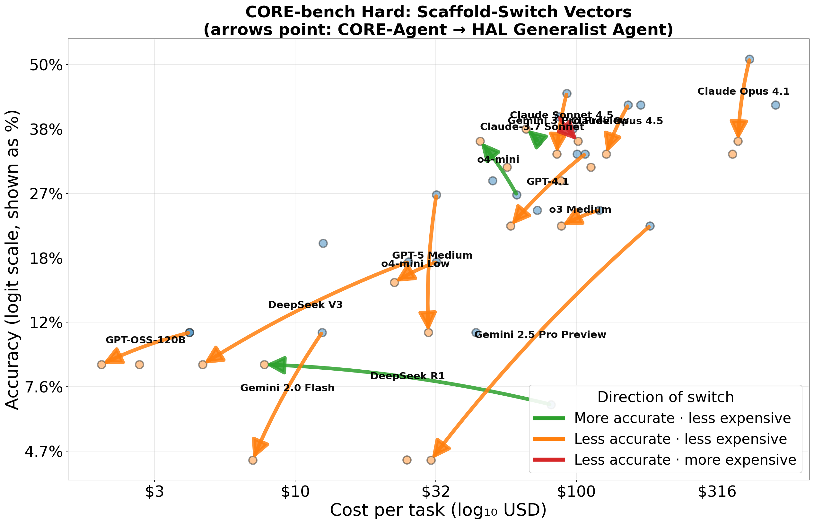</td>
</tr>
<tr>
<td>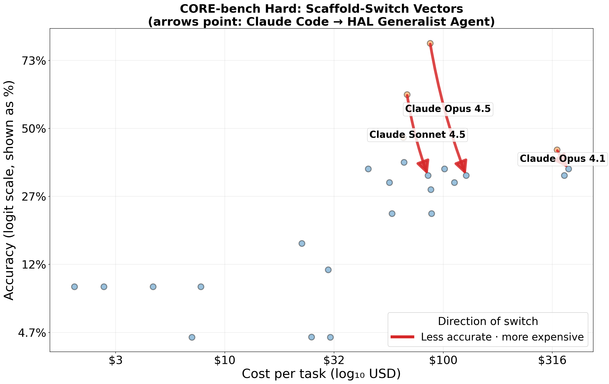</td>
<td>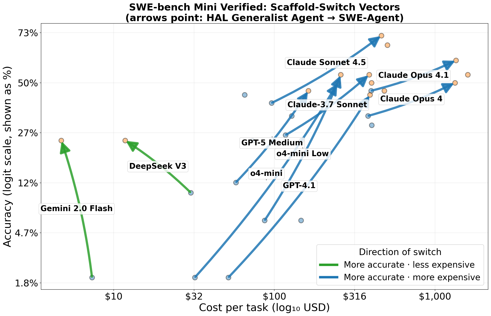</td>
</tr>
<tr>
<td>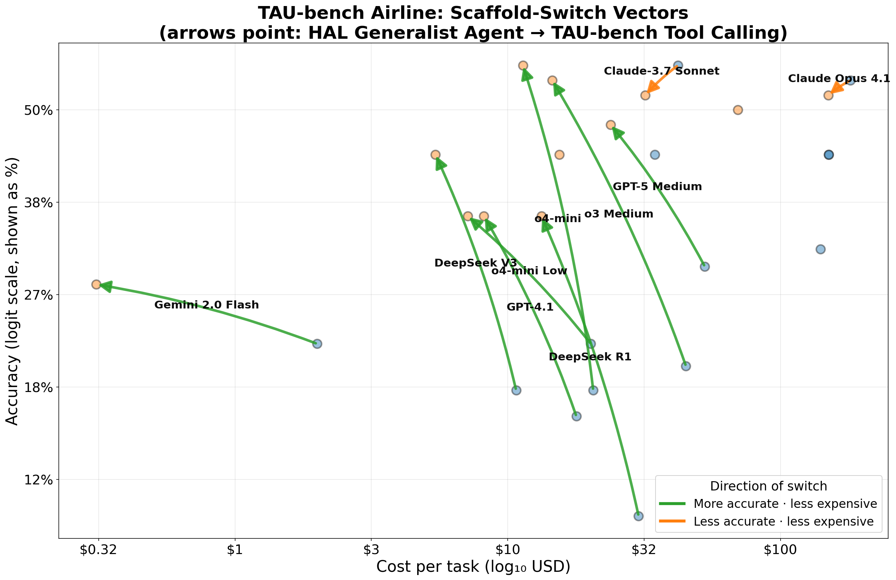</td>
<td>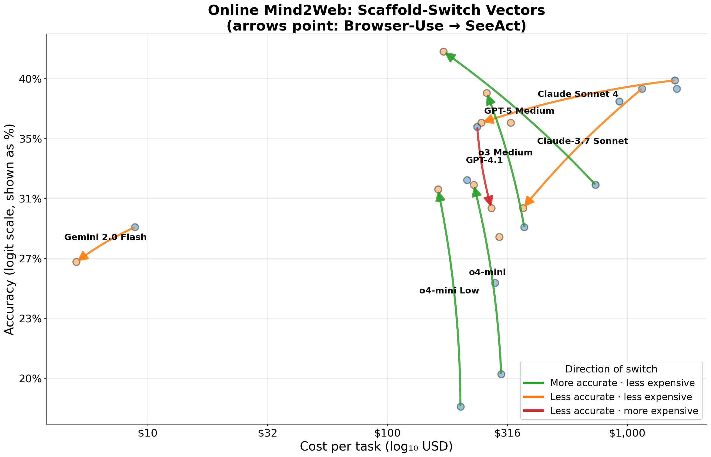</td>
</tr>
<tr>
<td>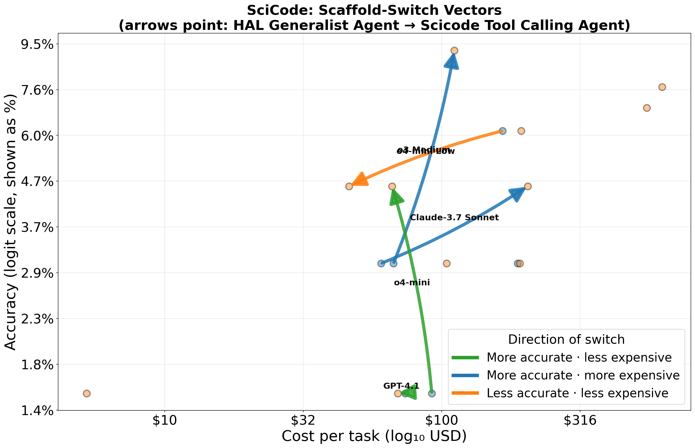</td>
<td>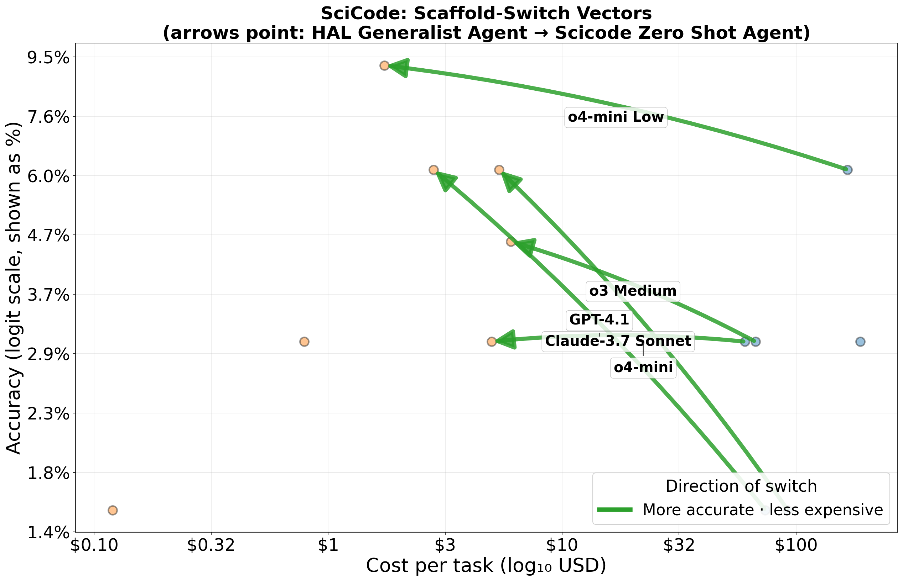</td>
</tr>
<tr>
<td>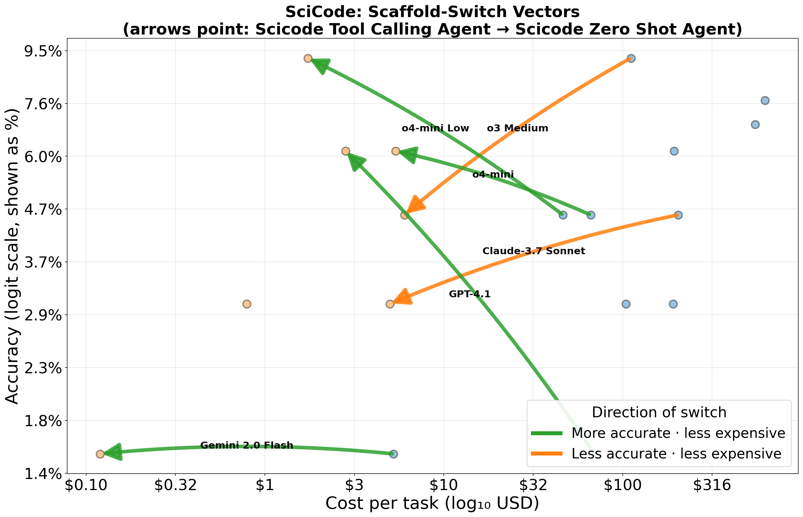</td>
<td>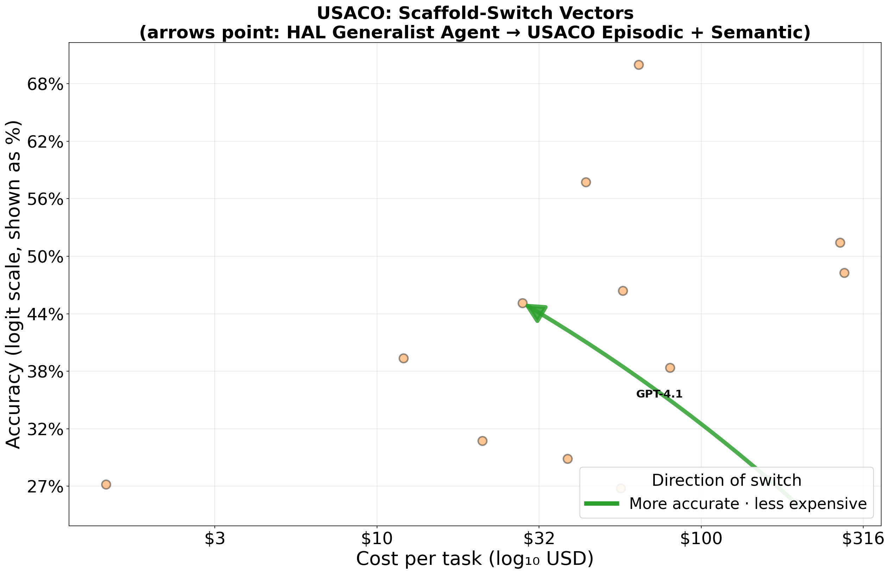</td>
</tr>
</table>

## Ranking Correlation Graphs

How well does a model's ranking on one scaffold predict its ranking on another? The chart below (left) shows Spearman ρ and Kendall τ rank correlations between scaffold pairs for each benchmark. Most pairs preserve ranking moderately well, but CORE-bench Hard (CORE-Agent → Claude Code) is notably negative — the best models on one scaffold are not the best on the other. Zooming in on GAIA (right) with τ=0.17, only about a 58% chance that any two models keep their relative order across scaffolds. Points on the green diagonal kept their ranking; the reds (e.g. DeepSeek V3, o3 Medium) jump far off it.

  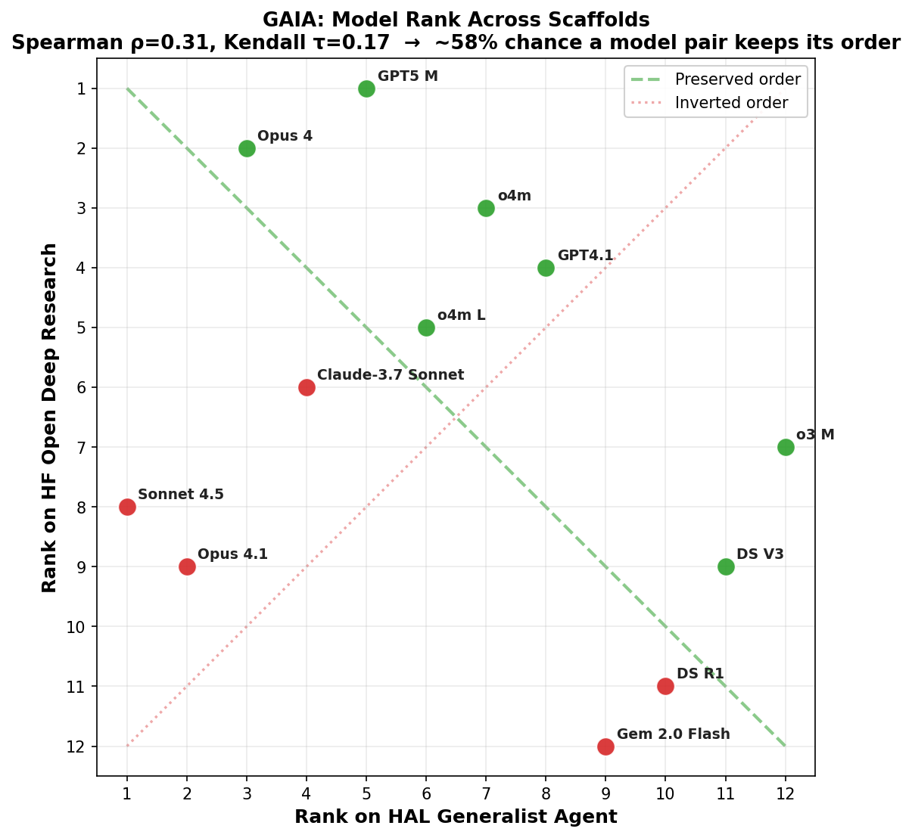

  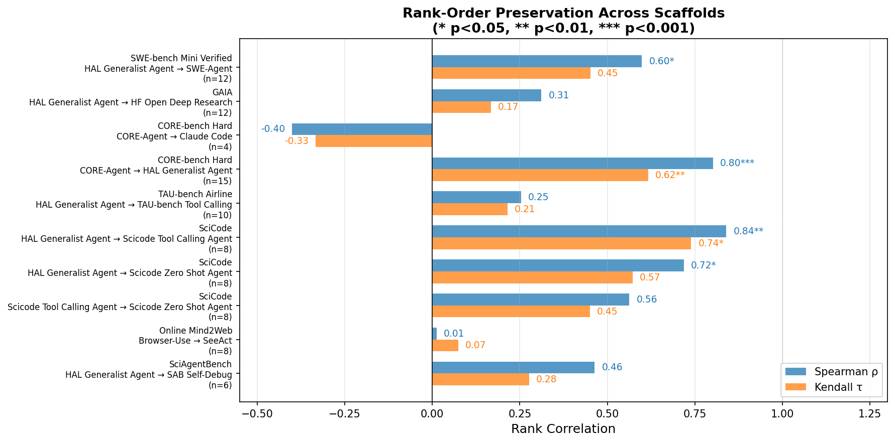

<!-- ==============================================
Junk :
= -->

<!-- System prompt
Developer prompt
Task instructions
Tool definitions
Tool-use format
Bash/terminal access
File editing tools
Code search tools
Test-running tools
Docker/sandbox environment
Repo setup and dependencies
Agent loop: think → act → observe → repeat
Observation formatting
Context-window management
Memory/summarization
Retrieval or repo-map system
Planning prompts
Reflection/self-critique steps
Multi-agent reviewer/coder setup
Stopping rules
Token/time/cost limits
Patch submission format
Post-processing of diffs
Evaluation harness
Caching strategy -->
-
<!-- 

# Does Scaffolding Matter Less At Higher Capabilities

- graphs of capabilitey correlation -->